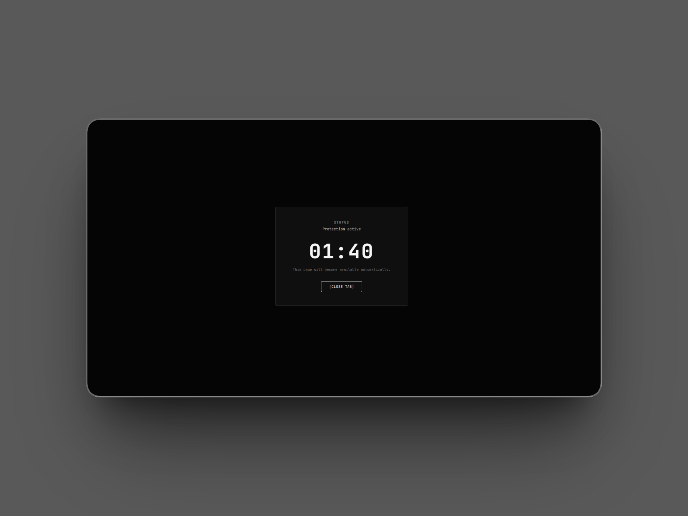
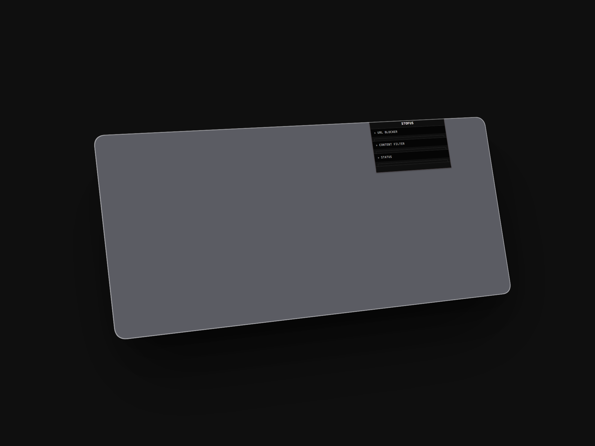
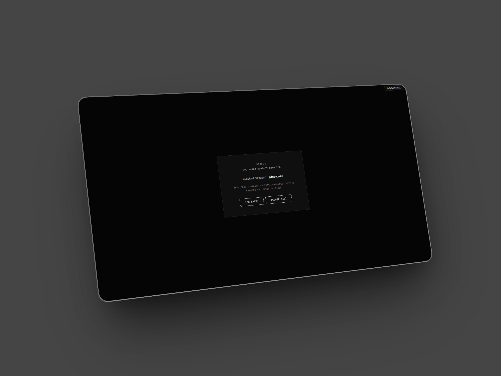

# STOFUS 

A browser extension that adds friction between you and the sites you're trying to avoid. It works on Chromium-based browsers - Chrome, Brave, Edge, and others.

---

## Preview

  
   
  

---

## What it does

- **Schedule Block**: blocks a site during a recurring daily time window. Repeats every day until you remove it. No bypass during the blocked period.
- **Timer Block**: blocks a site for a fixed duration up to 30 days. No unlock, no exceptions. The only exit is the friction page.
- **Keyword Filtering**: scans pages for words you've flagged. Triggers a block on match. Includes an unintentional bypass for false positives.
- **Friction Page**: removing any blocked site requires waiting between 60 seconds and 5 minutes depending on how long it was blocked, then typing a confirmation phrase. The wait is intentional.

---

## What it doesn't do

STOFUS doesn't block other browsers on your device. It doesn't block your phone. It can't prevent you from disabling or uninstalling it.  
If you're determined to get through, you will get through. STOFUS isn't a lock. It's the pause between impulse and action - long enough that you might change your mind.  
It works best for people who already want to stop but struggle with the moment of weakness. If you're not there yet, no tool will get you there.

---

## Privacy

Everything stays local. No accounts, no servers, no tracking.

---

## Installation

1. Clone or download this repository
2. Go to `chrome://extensions` in your browser
3. Enable Developer Mode
4. Click Load unpacked and select the STOFUS folder
5. Pin it and configure your blocks

### Enable incognito protection

STOFUS doesn't run in incognito by default. To fix this, go to `chrome://extensions`, find STOFUS, and enable "Allow in Incognito."

---

Built for the moment of clarity. Not for the moment of craving.
